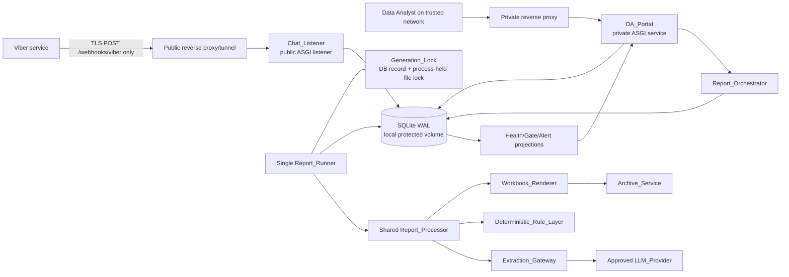
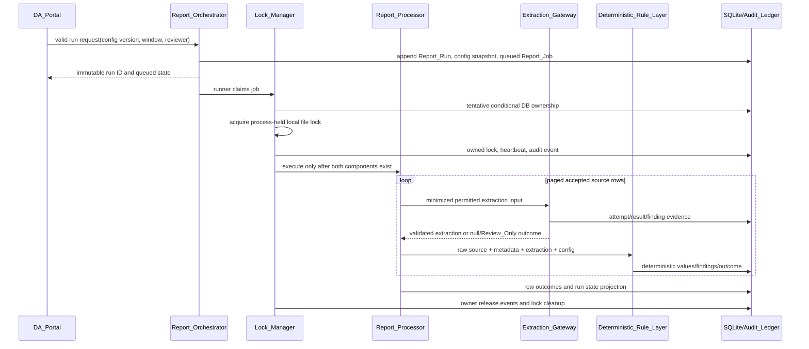
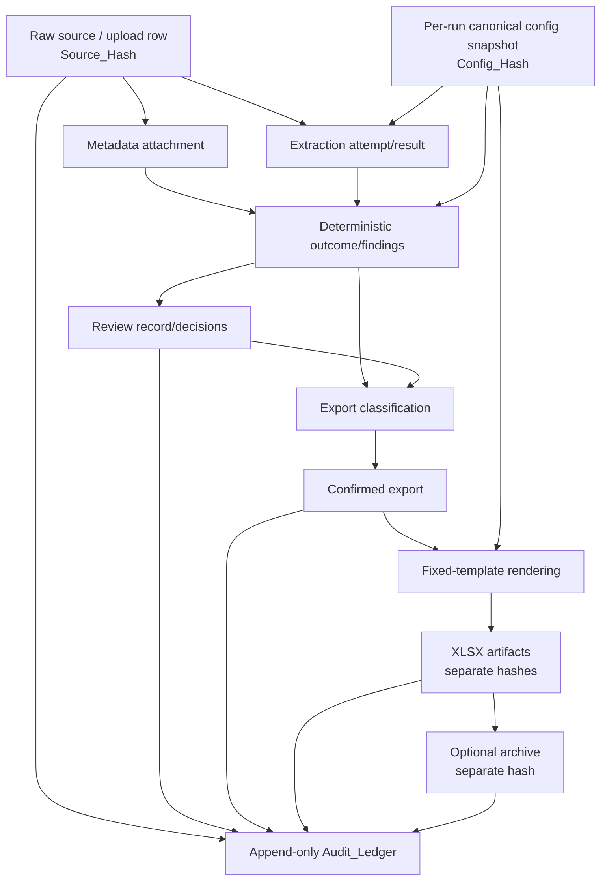
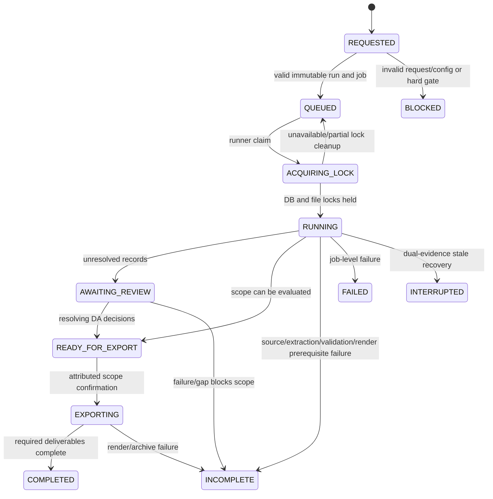

# Technical Design: MC03 Bank Report Automation

## Design status and scope

This design refreshes the approved [requirements](requirements.md) for the requirements-first `mc03-bank-report-automation` feature. It defines the technical design and test approach only; it does **not** approve production behavior where the requirements retain an open question, review-only condition, or Production_Gate.

The system is an on-premises Python application that turns immutable external source evidence into configuration-driven report outcomes for Data Analyst (DA) review. It supports DA-triggered runs, pluggable ingestion, narrowly constrained LLM extraction, deterministic validation, review decisions, controlled XLSX generation, optional encrypted archives, and manual DA delivery. It does not schedule runs, permit direct workbook editing, accept user-uploaded templates, automatically transmit bank files, invent campaign rules, or bypass any approval gate.

The following remain intentionally unresolved and must remain explicit gates or `Review_Only` outcomes until approved evidence is recorded: Viber commercial/provisioning/group/TLS/endpoint feasibility; LLM compliance, provider handling, and redaction policy; TFS RFD authority and L2/L3 placement; RCBC source authority, cap, export policy, and password format; CBS walkthrough/cutoff/timezone/status/RFD/contact rules; approved templates and mappings; archive recipient compatibility; and operations/access/capacity thresholds.

### Design principles

1. **Configuration, not campaign branches.** Every Campaign is processed by the same pipeline and generic rule primitives. Campaign identity is data in a validated configuration, never a `if campaign == ...` processing branch.
2. **Evidence precedes transformation.** Raw source bytes/content and hashes are durable before metadata attachment, extraction, validation, review, or export classification.
3. **Deterministic authority.** The LLM performs only schema-bound extraction of permitted remark text. It cannot identify accounts, decide statuses/RFDs/placement/inclusion, or override deterministic findings.
4. **Safe incompleteness.** Missing approval, invalid data, ambiguity, low confidence, source gaps, configuration defects, and infrastructure faults become visible failures, gates, or `Review_Only` records—not inferred business values.
5. **Append rather than overwrite.** Sources, configuration snapshots, processing outcomes, decisions, retries, exports, artifacts, and audit events are immutable facts linked by predecessors/successors.
6. **Private by default.** The only public surface is the exact `POST /webhooks/viber` route. DA portal access is private unless a separately approved authenticated offsite mode is enabled.
7. **Single-host correctness.** SQLite WAL, the database lock, and the process-held file lock operate on one host and one local protected volume. Horizontal report-worker scaling is out of scope for v1.

## Research foundations

The requirements are the authoritative behavioral source. Targeted implementation research informed the following constrained design decisions:

- [SQLite WAL documentation](https://www.sqlite.org/wal.html) explains that WAL relies on cooperating local processes and is unsuitable for a network filesystem. Therefore the SQLite database, `-wal`/`-shm` files, raw-source store, artifact store, templates, and lock file reside on one local protected volume; no SMB/NFS-mounted database is supported.
- The [Viber REST Bot API](https://developers.viber.com/docs/api/rest-bot-api/) describes commercial bot provisioning, a trusted-certificate webhook URL, and an availability callback after `set_webhook`. This supports separate gates for commercial/provisioning evidence, stable TLS endpoint, registration validation, and actual TFS group-message delivery; a registration callback alone is not group-delivery proof.
- [openpyxl formula documentation](https://openpyxl.readthedocs.io/en/stable/simple_formulae.html) indicates formulas can be preserved but are not evaluated by the library. The renderer therefore preserves formula expressions and relies on Excel recalculation when a workbook is opened; server-side formula calculation is not a completion requirement.

These findings are paraphrased for compliance with licensing restrictions. They support technical constraints only and do not replace the requirements’ Production_Gates.

## Overview

### Objectives and v1 boundaries

A DA explicitly requests every `Report_Run` by selecting a Campaign, a schema-valid Campaign_Configuration version, a valid Report_Window, and a nonblank Reviewer_Name (or authenticated actor where authentication is required). The system creates an immutable run, processes accepted source rows through a shared pipeline, records deterministic outcomes and review requirements, and allows a DA to confirm a visible export scope before controlled artifacts are rendered.

A run may contain 50,000 Accepted_Source_Rows. The design uses streaming adapters, paged queries, batch persistence, and row-by-row artifact iteration so the browser never needs to hold a run in memory. This is not a production performance promise: elapsed-time, memory, hardware, backup/recovery, and capacity evidence remain operational gates.

Explicit v1 exclusions are: report scheduling; direct DA editing of XLSX; arbitrary template upload; automatic external delivery; TFS attachments; Viber edit/delete processing as report text; TFS call-efforts/callouts before approval; LLM identifier extraction; plate-repository automation; Viber fallback lookup chains; offsite unauthenticated portal use; and archive modes other than `aes_256` or approved `zipcrypto`.

### Recommended technology boundaries

| Concern | Design choice | Constraint / rationale |
| --- | --- | --- |
| Runtime and services | Python 3.12+; FastAPI ASGI applications behind a reverse proxy | One private portal service and a minimal public listener service; package/runtime versions are pinned during implementation. |
| Configuration | Pydantic models, JSON Schema 2020-12, safe YAML/JSON parsing | Reject unknown fields, duplicate YAML mapping keys, unsafe tags, invalid syntax, invalid schema, and invalid cross-field combinations. |
| Persistence | SQLAlchemy, Alembic, SQLite WAL on local protected storage | Required initial engine/interface; migrations are versioned; all writers run on the same host. |
| Ingestion | Streaming CSV/XLSX readers and adapter protocols; pandas only inside adapters when useful | Parsing stays outside the shared processor and raw input remains the source of truth. |
| LLM transport | Provider adapters behind `Extraction_Gateway`, JSON Schema output validation, `httpx`-style bounded transport | The provider SDK or response never reaches campaign rules. |
| Artifact rendering | `openpyxl` from fixed approved templates | Formula expressions are preserved, not calculated server-side. |
| Archive output | `pyzipper` for AES-256; separately vetted adapter for ZipCrypto | ZipCrypto is visible as weaker compatibility-only mode. |
| Tests | pytest, Hypothesis, API/browser tests, fixture workbooks, fake adapters/providers/lock writers | Pure logic is generatively tested; infrastructure is tested with integration/smoke fixtures. |

No dependency, recommended library, or configuration default is business approval.

## Architecture

### Logical topology

All processes that access SQLite—including the Chat_Listener, private portal, runner, and stale-lock recovery utility—run on the same host and local data volume. The reverse proxy may be on an edge host only when it forwards over a restricted link and never mounts or accesses the database/filesystem.

### Exposure and route isolation

| Exposure | Process and route | Allowed behavior | Required rejection behavior |
| --- | --- | --- | --- |
| Public tunnel | Public listener: exact `POST /webhooks/viber` | Receive bounded Viber callbacks, durably persist source evidence, return a safe acknowledgment, emit listener health. | Any other public path returns a generic rejection without DA portal, API documentation, artifact, review, or admin content. |
| Public tunnel, wrong method | Exact `/webhooks/viber` using any method other than `POST` | None. The listener handler is not invoked. | Return a rejection response (normally `405` with no sensitive body); do not expose portal/artifact/docs/admin content. |
| Trusted internal network | Private portal routes and private APIs | DA run requests, review, decisions, alerts, export confirmation, preview, and download. | Never route through the public Viber virtual host. |
| Offsite/tunneled DA UI | Private portal after deployment-mode change | Same DA functions only with Session_Authentication. | Reviewer_Name-only attribution and unauthenticated UI are blocked. |
| Internal worker channel | Local runner command/process and DB | Claim queued jobs, acquire generation lock, process rows, render artifacts. | No browser/public invocation or concurrent report execution. |

The public proxy uses an allow-list rather than a deny-list: one exact route and one HTTP method. OpenAPI/Swagger/ReDoc, health details, template upload, administrative APIs, artifact downloads, and portal APIs are absent from the public listener. Private-network configuration must be demonstrable; otherwise portal startup blocks unauthenticated operation until session authentication, secure cookies, CSRF protection, expiry, logout, and authenticated actor auditing are active.

### Service composition and processing lifecycle

1. **Chat_Listener** is independently supervised and never takes Generation_Lock. It persists callbacks and listener heartbeats during report processing.
2. **DA_Portal** validates commands and appends evidence but never performs report processing in an HTTP request thread.
3. **Report_Orchestrator** creates immutable runs, snapshots selected configuration bytes/hash, queues jobs, and projects current status. There is no time-based scheduler.
4. **Report_Runner** claims queued work, owns lock lifecycle, and invokes the single shared Report_Processor only after both lock components are held.
5. **Report_Processor** attaches trusted metadata, invokes permitted extraction, applies generic deterministic rules, creates row outcomes, and hands only confirmed export work to the renderer.
6. **Storage services** expose repositories for immutable source/artifact bytes, relational projections, and the append-only Audit_Ledger. They are internal components, not network microservices.

A run projects to `REQUESTED`, `QUEUED`, `ACQUIRING_LOCK`, `RUNNING`, `AWAITING_REVIEW`, `READY_FOR_EXPORT`, `EXPORTING`, `COMPLETED`, `INCOMPLETE`, `FAILED`, `INTERRUPTED`, or `BLOCKED`. State changes are appended events; a mutable current-state projection is never the sole audit evidence.

### Phase-1 decision boundary

`Viber_Eligibility_Gate` evaluates recorded evidence for official bot provisioning, applicable commercial/verification terms, TFS group administrator permission, representative actual-group text delivery, trusted TLS, an approved persistent endpoint, and registration validation. A registration-validation callback proves route availability only; it does not prove actual-group delivery or complete Raw_Payload_Metadata.

If **any** required Viber condition is pending, absent, rejected, or unsuccessful, the system records failed evidence, marks TFS live chat ingestion deferred, and deterministically selects RCBC Auto Loan for Phase 1. The RCBC source design is Volare_Export plus approved Master_File resolution: authorized automated Volare access uses its configured adapter; otherwise, a manual Volare upload is accepted with explicit fallback evidence. RCBC Auto Loan never starts chat-bot processing. Passing the Viber gate only permits the TFS branch subject to its still-applicable LLM, business-rule, template, export, and operational gates.

## Components and Interfaces

### Component responsibilities

| Component | Responsibility | Key inputs | Key outputs / safeguards |
| --- | --- | --- | --- |
| Config_Parser / Config_Formatter | Validate YAML/JSON config, build typed representation, canonicalize, format for review | Raw configuration bytes | Validated config, canonical UTF-8 JSON bytes, SHA-256 Config_Hash; rejects unsupported behavior. |
| GateEvaluator | Resolve capability-specific production/review gates | Configuration, gate evidence, operational configuration | Approved, blocked, or `Review_Only` capability decision; no self-approval by configuration. |
| Report_Orchestrator | Validate requests and create immutable run/job facts | DA command, selected config, window, actor | Run ID, exact per-run config snapshot/hash, queued job, status projection. |
| SourceAdapter | Accept source input and choose candidate rows | Callback/file/source export | Immutable Raw_Source_Record or Source_Failure_Event; no report transformation. |
| Chat_Listener | Public Viber endpoint and listener health | POST callback | Raw callback evidence, registration or group-message classification, heartbeat/alert facts. |
| Extraction_Gateway | Enforce data minimization and provider-neutral extraction | Raw remark, configuration, approved operations policy | Schema-validated extraction/null values, provider audit evidence, no business decision. |
| Deterministic_Rule_Layer | Generic configuration-driven transformation and validation | Raw source, metadata, extraction, config, window | Derived values, one Validation_Finding per applied rule, disposition. |
| Review service / DA_Portal | Review context, decision and edit validation | Review command, reason, attribution | Immutable Review_Decision/value version or rejection that preserves prior state. |
| Lock_Manager | DB/file locking, heartbeat, release, stale recovery | Job, operating thresholds | LockLease or fail-closed queued/rejected/interrupted state. |
| Export_Workflow | Classify all rows, confirm scope, enforce coverage/policy gates | Run outcome set, scope, DA confirmation | Immutable export snapshot/counts or a visible block. |
| Workbook_Renderer | Render fixed-template XLSX outputs only for active owner | Confirmed export, template, LockLease | Bank-facing and internal artifacts or visible rendering failure. |
| Archive_Service | Create optional encrypted archive after XLSX completion | Completed XLSX, approved archive config | Separate archive artifact/evidence or failure preserving XLSX. |
| Audit_Ledger / HealthEvaluator | Append evidence and create alert/gate projections | All stateful actions/events | Immutable audit events, Critical_Alerts, Source_Gaps, coverage assessments. |

### Campaign configuration contract

#### Parse, canonicalize, select, and snapshot

Config_Parser accepts UTF-8 YAML or JSON. It rejects duplicate mapping keys, unsafe YAML tags, syntax errors, unsupported schema versions, unknown fields, invalid types, and invalid cross-field combinations. A schema-valid document becomes a typed `ValidCampaignConfig`, then deterministic canonical UTF-8 JSON with sorted object keys and normalized value representation:

`Config_Hash = SHA-256(exact_canonical_config_bytes)`.

Config_Formatter emits a human-readable rendering of this validated representation. `parse(format(config))` must be semantically equivalent for every supported field and reproduce the same canonical bytes/hash. Original YAML comments/spacing are not treated as source-of-truth semantics; the immutable canonical bytes are.

When a run is requested, the system writes a **per-Report_Run configuration snapshot** containing the selected configuration identity/version, exact canonical bytes, Config_Hash, and selection time in the same transaction as the Report_Run. The runner reads this snapshot, never a mutable `latest` configuration pointer. Any attempt to alter selected snapshot bytes or Config_Hash is rejected, audited as an attempted immutable alteration, and shown to the requesting DA.

The schema carries sources, extraction policy, vocabulary, ranks, tie-breaks, exclusions, formats, templates/mapping identities, archive policy, export policy, validation rules, and production-gate references. It accepts a new Campaign using those supported fields without changing Report_Processor. A requested behavior that cannot be represented receives `DESIGN_REVIEW_REQUIRED`; arbitrary extension fields cannot smuggle unapproved behavior into processing.

| Configuration area | Required design behavior |
| --- | --- |
| `sources` | Allowed adapters, metadata contract, report-window/timezone semantics, coverage requirements, source authorization/gates. |
| `extraction` | Enabled state, result schema ID, one approved redaction mode, confidence threshold, allow-listed non-identifying context, and forbidden output fields. TFS forbids account-identifier extraction fields. |
| `rules` / `validation` | Vocabulary, rankings, tie-breaks, exclusions, limits, formatting, duplicate/window behavior, banned terms, review-only fallback. |
| `export` | Full-export policy state and eligible dispositions. An unapproved or missing policy cannot enable Full_Export. |
| `templates` | Fixed template identity/version, approved Output_Mapping_Regions, and template gate references. |
| `archive` | Disabled or one legal mode, approved password-format ID, recipient compatibility gate, and no secret values in configuration projections. |
| `production_gates` | Capability-scoped pending/approved/rejected references; configuration cannot approve its own evidence. |

### Source adapters and immutable evidence

All adapters use the same durable acceptance sequence:

1. Validate transport and adapter-specific mandatory fields without deriving a report value.
2. Determine a trustworthy original source identity/idempotency key where available; otherwise retain an ingestion identity and full Source_Hash.
3. In one transaction, persist original callback/file content or protected immutable reference, acquisition metadata/time, source type, Source_Hash, and initial Audit_Ledger event.
4. Create Accepted_Source_Row membership only after raw evidence commits. If acceptance/parsing fails, append Source_Failure_Event and audit evidence instead.
5. Acknowledge the caller only after relevant evidence is durable. Retries deduplicate or link to earlier evidence; they do not replace it.

A manual upload creates an `Uploaded_Source_File` record with original filename/identity, bytes/reference, Source_Hash, uploader attribution, and acceptance time. Each accepted row keeps that original file identity/hash and original row reference. Re-parsing produces linked outcomes; it cannot replace original bytes or mappings.

**Viber handling.** The public listener classifies an incoming callback before campaign interpretation:

- A Viber_Registration_Validation_Callback stores registration health after `set_webhook` at the approved stable endpoint.
- A potential TFS Viber_Group_Message_Callback stores complete original JSON and derives Raw_Payload_Metadata only from direct callback fields: substantive source token/message ID, timestamp, sender ID, sender display name, group/channel ID, and text body.
- Missing, ambiguous, empty, whitespace-only, or configured placeholder values create a finding and `Review_Only`; the listener must not call account/group/member/later lookup APIs to fill missing fields.
- Attachment and edit/delete callbacks are persisted as out-of-scope evidence and never treated as TFS text capture.

Volare, DRR, internal, and Master_File adapters use the same raw-evidence and source-authorization gates. For RCBC, manual Volare upload is an approved fallback only when automated access is unavailable and the fallback is recorded.

### Provider-neutral LLM extraction and privacy boundary

Extraction_Gateway is the sole component permitted to invoke an LLM_Provider. It is provider-neutral and has four mandatory phases:

1. **Eligibility.** Verify approved LLM capability, provider/model handling, Redaction_Mode, extraction schema, compliance evidence, and Operational_Configuration timeout/retry policy. An unapproved selection produces a validation finding and blocks extraction.
2. **Request minimization.** Construct a new allow-listed request; never serialize a raw source object, callback payload, account number, phone, source ID, filename, Reviewer_Name, artifact metadata, or arbitrary configuration.
   - `raw`: only Remark_Text plus permitted non-identifying vocabulary/context. Structured identifiers may appear only incidentally inside permitted raw Remark_Text.
   - `text-redacted`: remove structured identifiers from Remark_Text before request construction; no structured identifier may appear in any outgoing field.
3. **Transport.** Select an approved provider adapter, apply only the selected operational timeout/retry policy, and record provider/model/mode/policy/outcome plus a safe request-field manifest/fingerprint. Secrets and prohibited input are not retained for debugging.
4. **Schema and uncertainty handling.** Parse provider JSON against the approved result schema. A malformed, missing, invalid, or low-confidence field becomes null with a finding and `Review_Only`; no repair prompt, heuristic, or provider follow-up may invent a replacement business value.

An outgoing `NoProhibitedIdentifierOutsidePermittedRemark` guard validates the constructed request a second time. It removes/rejects prohibited data, records `LLM_INPUT_PRIVACY_BLOCKED`, and prevents that data from being sent. Deterministic values/findings, once emitted, cannot be overridden by a provider response.

### Deterministic rule layer and campaign safety

Deterministic_Rule_Layer is a generic domain service over immutable `RawSourceRecord`, `MetadataAttachment`, schema-valid `ExtractionOutcome`, selected configuration snapshot, and Report_Window context. It returns derived values, a disposition, and a persisted Validation_Finding for every applied configured rule. Generic primitives include vocabulary membership, precedence/ranking, tie-breaks, exclusions, duplicate/window validation, string formatting/trimming, relationship classification, marker removal, and review routing.

Equivalent immutable inputs and the same configuration snapshot produce equivalent values/findings. Missing, unknown, conflicting, unconfirmed, or unresolvable rule states retain candidates and route to `Review_Only`; the LLM is never a conflict resolver.

| Campaign | Automated behavior permitted only when approved | Mandatory safe state when unresolved |
| --- | --- | --- |
| TFS Auto | Direct source metadata or direct approved account lookup; approved final status/RFD vocabulary; approved placement; configured banned-term rules. | No LLM identifier extraction, plate repository, or Viber fallback lookup. Pending account/RFD/Final_Status/L2-L3 conditions are null/Review_Only. Social-media references except allowed `ST`/`skip tracing` terms receive Banned_Term finding. |
| RCBC Auto Loan | Final status limited to Resolved/Retained/Deleted; primary rank, explicit-secondary rank, latest-date tie-break; positive representative relation allow-list; approved cap/trim policy; marker removal. | Pending cap/password/export/source authority remains gated. If contacted-person and statement cannot both fit, Review_Only—not silent loss. |
| CBS Auto | Only approved DRR Today/Yesterday + approved incremental cutoff after all selection inputs/cutoff/timezone/system-wide approvals; configured status/remark exclusions. | Any pending selection/status/RFD/contact approval keeps affected result Review_Only. TFS/RCBC rules cannot be inherited. |

### Review, export, and artifact workflow

DA_Portal exposes immutable raw content, record/account context, derived values, findings, and decision history. A structured/report value edit must have a nonblank reason and Reviewer_Name or authenticated actor identity and must conform to active configuration. A rejected edit or decision preserves prior state and shows failed validation rules. A valid edit appends prior/new value, reason, attribution, time, and source/run linkage; raw source is never changed.

Reprocess creates a linked successor processing outcome only. An unresolved `Review_Only` record cannot automatically finalize. There is no direct XLSX editing route.

Export_Workflow creates a persisted classification snapshot before confirmation. It requires exactly one scope (`Full_Export` or `Partial_Export`), assigns exactly one category to each Accepted_Source_Row (`included`, `excluded`, `unresolved`, or `failed`), displays all category counts and separately displays Source_Failure_Event count. Full export applies only an approved active policy; Partial_Export contains only Approved_Records or Explicitly_Accepted_Records. Confirmation requires a nonblank reason, attribution, and time. Omitted candidates remain visible with category, reason, time, and count. A TFS Source_Gap overlapping the selected window requires Source_Coverage_Assessment and an explicit DA decision before export.

TemplateRepository resolves only a fixed approved template identity/version from selected configuration. Workbook_Renderer validates approved Output_Mapping_Regions, snapshots protected template content, writes only mapped cells, then verifies formula expressions, formatting, hidden sheets/cells, and all non-mapped content remain equivalent. It creates separate bank-facing and internal/system-import XLSX artifacts, each with its own Artifact_Hash and audit event. Rendering failure is visible and cannot yield an unrecorded substitute. A substitute XLSX must itself pass template validation and receive separate type/template/config/hash/audit evidence before availability.

Archive_Service runs only after completed XLSX evidence exists. It accepts `aes_256` or `zipcrypto` only; AES-256 uses pyzipper and ZipCrypto uses a separately vetted adapter visibly marked compatibility-only. Password derivation uses an approved format ID through a secret-value boundary. Passwords/derived secrets must not occur in UI, logs, Audit_Ledger payloads, or file names. An archive is a separate artifact with its own hash, encryption mode, and recipient compatibility state. Failure preserves completed XLSX bytes/hashes/audit evidence. Any substitute archive needs independent mode/compatibility/hash/audit evidence before download; incomplete evidence prevents availability.

### Generation lock and crash recovery

Generation_Lock has two mandatory components: a singleton conditional database lock row and an exclusive local OS/process/file lock held by the runner process for its complete execution. Both are required before any row processing or workbook write.

1. Read the selected approved Operational_Configuration lease, heartbeat, and stale criteria.
2. In an immediate SQLite transaction, conditionally claim the singleton row as `tentative(job_id, fencing_token, acquired_at)`.
3. Acquire a nonblocking exclusive local file lock at the protected fixed path. Retain the handle in the runner process.
4. In a new immediate transaction, verify tentative ownership/fencing token, mark `owned`, persist heartbeat, and append audit events. Only then invoke Report_Processor.
5. If either component fails, release any component already acquired, append acquisition failure/queue evidence, and never execute.
6. Heartbeat only while ownership remains current. Workbook_Renderer rechecks owner and fencing token immediately before writing.
7. On terminal outcome, only the matching owner/fencing token can release both live lock components. A failed release is audited and blocks later execution. A non-owner release is rejected and audited.
8. A successor may recover only after observing both stale lease/heartbeat evidence under approved configuration **and** proving the predecessor file lock is absent. It appends the predecessor `INTERRUPTED` event, conditionally releases the stale database lock record, records that release, and only then acquires/grants a new lock to the successor. If any recovery step fails, later execution remains blocked.

The Chat_Listener is deliberately excluded from Generation_Lock and continues short durable writes under WAL while a runner holds it.

### Production-gate evaluation

GateEvaluator runs at configuration approval, service startup, run request, source-adapter activation, LLM request construction, export confirmation, archive creation, and production-release validation. Gates are distinct immutable evidence records with `pending`, `approved`, or `rejected` state; configuration documents cannot self-approve them.

| Gate family | Required before capability | Fail-closed result |
| --- | --- | --- |
| Viber feasibility | Official/commercial provisioning, business verification where applicable, group permission, actual group-message proof, trusted TLS, persistent host/route, registration validation, listener health thresholds | TFS live chat deferred; Phase 1 pivots to RCBC. |
| LLM privacy | Compliance/disclosure, provider/model handling, exactly one approved redaction mode, result schema, retry/timeout policy | LLM-assisted production extraction is blocked; affected record follows approved non-LLM path or Review_Only. |
| TFS business rules | RFD authority/vocabulary, placement, final status, direct lookup and skip-tracing policy | Affected fields remain null/Review_Only. |
| RCBC source/rules | Volare authorization/access, Master_File owner, cap, export policy, password format | Affected automation/export/archive default is blocked or Review_Only. |
| CBS rules | Walkthrough, selection inputs, cutoff semantics/timezone, system-wide applicability, status/RFD/contact approval | CBS affected outcomes remain Review_Only. |
| Artifacts/export | Templates, mappings, samples, vocabularies, window/timezone, Full_Export policy | Affected artifact or Full_Export capability is blocked. |
| Archive | Recipient encryption compatibility, password-format approval, ZipCrypto writer approval when applicable | Production-default archive blocked; completed XLSX retained. |
| Operations/access | Retention, backups, recovery, capacity, trusted ranges/auth mode, thresholds, lock/listener heartbeat criteria | Production release or unauthenticated portal deployment blocked. |

## Data Models

### Persistence and immutability conventions

SQLAlchemy mappings use UUID primary keys, UTC timestamps, explicit foreign keys, and database constraints. SQLite enables foreign keys and WAL during initialization. Busy handling, batch sizes, retry budgets, lease durations, heartbeat intervals, registration deadlines, and repeated-failure thresholds come only from approved Operational_Configuration—not hard-coded defaults.

Raw sources, selected configuration snapshots, completed artifacts, review decisions, run events, lock events, and Audit_Ledger events are append-only. Current-state fields are projections updated transactionally with a new event. Repository APIs expose insert/query behavior for immutable facts; attempted updates/deletes are rejected and audited. Protected content may be held in local object paths, but its storage identity/hash/access-control record remain immutable in the database.

### Relational model

| Entity/table | Essential fields and links | Important constraints |
| --- | --- | --- |
| `campaign_configuration_versions` | Campaign code/version, schema version, canonical bytes, Config_Hash, parsed JSON, validation report | Unique campaign/version and Config_Hash; never updated after validation. |
| `report_run_configuration_snapshots` | Report_Run ID, selected config ID/version, exact canonical bytes, Config_Hash, selected time | Immutable per-run copy; no report processing dereferences mutable latest configuration. |
| `operational_configuration_versions` / snapshots | Provider retry/timeout, lock/listener leases, registration deadlines, thresholds, version/hash | Explicitly selected by service/run; approved values only. |
| `production_gates` / `gate_evidence` | Gate ID, scope, owner, status, evidence reference, actor/time | Effective gate state derives from append-evidenced records. |
| `report_runs`, `report_jobs`, `run_state_events` | Campaign/config/operations snapshot, window, reviewer/actor, predecessor run, job claims, event history | Immutable request facts; one queued job per run attempt; current state is projection. |
| `uploaded_source_files`, `raw_source_records` | Original identity/content/reference, type, acquisition metadata/time, Source_Hash, source token, upload parent | Content/hash immutable; source token/hash indexes support idempotency. |
| `source_failure_events`, `accepted_source_rows`, `run_source_memberships` | Failed stage/input/error, raw source/file row, run membership, row outcome | Failure events remain separate from accepted rows; no hidden omissions. |
| `metadata_attachments`, `extraction_attempts`, `extraction_results` | Trusted metadata source/version; provider/model/mode/manifests/policy; schema/confidence/values | New facts link prior facts; prohibited provider input/secrets excluded. |
| `deterministic_outcomes`, `validation_findings` | Rule ID/version, candidate refs, result/null, disposition, reason | One finding per applied rule; prior processing outcomes preserved. |
| `review_records`, `review_decisions`, `review_value_versions` | Review projection, prior/new values, reason, reviewer/actor, time, linked outcomes | Nonblank reason/attribution required; raw source never edited. |
| `exports`, `export_row_classifications` | Scope, confirmation, category per row, counts, source-failure count, coverage assessment | Exactly one category per row per export; confirmation immutable. |
| `templates`, `artifacts`, `artifact_members` | Template ID/version/mappings; artifact type/path/hash/config/export; archive metadata/members | Completed artifact evidence immutable; archive is a separate artifact. |
| `generation_locks`, `lock_events`, `heartbeats` | Singleton owner/fencing token/state, acquisition/release/denial/recovery events | Compare-and-set ownership; denied/recovery actions append events. |
| `listener_health`, `critical_alerts`, `source_gaps`, `coverage_assessments` | Registration/delivery/heartbeat evidence, alerts, intervals, DA assessment | Resolution appends evidence; alerts are never silently erased. |
| `audit_ledger` | Ordered event ID, event type, actor/service, entity references, safe payload, time | Append-only cross-entity evidence; password/session/token fields are prohibited. |

High-value indexes include configuration hash, `(campaign_code, version)`, source hash/token, `(run_id, row outcome)`, `(run_id, export category)`, review state, lock owner/state, and open critical alerts. The system stores no archive password or derived secret in a database projection, audit payload, file name, or portal model.

### Lineage graph

### State models

Each accepted row independently reaches an inclusion candidate, excluded, unresolved, or failed export category. Source_Failure_Events that never became rows remain separately counted. This prevents a run from appearing complete by hiding omitted inputs.

## Correctness Properties

The statements below define universal behaviors that must hold across all valid executions of the system, connecting human-readable requirements to machine-verifiable guarantees.

Hypothesis-driven generative tests are appropriate for the feature’s pure or mockable configuration, extraction-boundary, deterministic-rule, lineage, state-machine, export, and transformation logic. They are not used to prove real Viber commercial terms/TLS/group delivery, reverse-proxy deployment, SQLite implementation behavior, actual archive-recipient compatibility, browser layout, or backup operations; those are integration, smoke, security, or operational acceptance checks.

### Non-redundancy reflection

The acceptance-criteria prework identified these consolidations:

- Canonical parse/format/hash behavior and immutable per-run configuration snapshot behavior form one configuration-evidence property; invalid/unsupported configuration routing remains a separate safety property.
- Raw source durability, upload row lineage, failure visibility, and source-to-value ancestry form one source-evidence property rather than several overlapping assertions.
- Both redaction modes, prohibited-field blocking, approved mode/provider selection, and TFS schema omission form one request-boundary property. Result uncertainty and deterministic authority form a separate outcome property.
- Configured rules, conflicts, duplicate/window safety, and deterministic replay form one rule-engine property.
- Edit/decision validation, append-only history, unresolved-finalization prevention, and reprocessing form one review-history property.
- The lock requirements are a single state-machine property because partial acquisition, ownership, rendering, release, and recovery are all consequences of one fencing model.
- Category conservation, scope confirmation, Full_Export policy, Partial_Export membership, and omission visibility form one export property.
- Template preservation/substitute validation and archive secrecy/failure/substitute behavior remain separate because they protect different artifact types.
- Viber callback provenance/health/coverage, Phase-1 pivot, TFS rule gates, RCBC transformations, CBS isolation, and generalized Production_Gates each retain independent value because they exercise distinct domain rules.

Each property below is implemented by exactly one Hypothesis property/state-machine test with at least 100 examples using fakes or in-memory adapters where external calls would dominate.

### Property 1: Canonical configuration and immutable selected snapshot

For all schema-valid Campaign_Configurations and valid Report_Run selections, parsing, canonicalizing, formatting, and parsing again produces semantically equivalent configuration values; Config_Hash equals the SHA-256 digest of the exact stored canonical bytes; the selected run retains those exact bytes/hash; and any attempt to alter them is rejected and audited without changing the retained snapshot.

**Validates: Requirements 1.3, 1.5, 21.1, 21.2**

### Property 2: Configuration-driven processing and safe unsupported behavior

For all supported schema-valid Campaign_Configurations and equivalent source contexts, the same shared pipeline and generic rule interfaces are used, declared configuration changes affect only governed outcomes, a new supported Campaign is selectable without a campaign-specific branch, and missing/invalid/unsupported configurations produce blocked or design-review-required results without executable rules.

**Validates: Requirements 1.1, 1.2, 1.4, 1.6, 1.7**

### Property 3: Immutable run creation and accepted-row coverage

For all valid DA run requests, creation produces a distinct immutable Report_Run containing the selected Campaign, configuration version/hash, window, attribution, request time, and queued job; for all finite Accepted_Source_Row sets, every member has exactly one visible terminal, Review_Only, or failed outcome; and invalid requests create neither an executable run nor job.

**Validates: Requirements 2.2, 2.3, 2.5**

### Property 4: Raw-source preservation, file-row lineage, and failure visibility

For all accepted callbacks, source messages, uploads, and original file rows, immutable raw evidence and Source_Hash exist before transformation, each uploaded row retains original file identity/hash and row reference, all derived values preserve lineage to raw source/run/configuration, and every simulated acquisition or parser failure creates separate visible source-failure and audit evidence rather than an omitted accepted row.

**Validates: Requirements 3.3, 3.4, 3.5, 12.1**

### Property 5: LLM request minimization and redaction safety

For all Remark_Text, metadata, structured identifiers, approved contexts, providers, and modes, a raw request contains only permitted raw Remark_Text plus allow-listed non-identifying context and no Structured_Identifier elsewhere; a text-redacted request contains no Structured_Identifier in any field; unapproved mode/provider selections or prohibited outgoing fields produce no provider request containing the prohibited value; and a TFS extraction schema cannot expose account identification.

**Validates: Requirements 4.2, 4.3, 4.4, 4.8, 4.9, 16.2**

### Property 6: Extraction uncertainty, audit policy, and deterministic authority

For all provider response sequences, extraction schemas, confidence thresholds, and approved retry/timeout policies, malformed, schema-invalid, missing, low-confidence, unavailable, exhausted, or unparseable results yield null affected fields, visible evidence, and Review_Only without synthetic replacement; audit evidence reflects the selected provider/model/mode/policy; and no provider proposal changes a prior deterministic value or Validation_Finding.

**Validates: Requirements 4.5, 4.6, 4.7, 4.10, 4.11, 12.2**

### Property 7: Deterministic rule replay and safe ambiguity routing

For all equivalent immutable raw source, metadata, valid extraction, report-window, and Campaign_Configuration inputs, deterministic evaluation produces equivalent values/findings, records a finding for every applicable configured rule, retains conflicting candidates, and routes missing, unknown, conflicting, duplicate, window, or unresolvable conditions to Review_Only without silent inclusion or LLM conflict resolution.

**Validates: Requirements 5.1, 5.2, 5.3, 5.4, 5.5, 5.6**

### Property 8: Review-decision validity and append-only reprocessing

For all proposed edits, decisions, records, and active configurations, an edit is accepted exactly when it conforms to configuration and has nonblank reason/attribution; every valid edit or decision appends complete prior/new/source/run history without changing raw evidence; unresolved Review_Only records cannot auto-finalize; and every reprocess creates a linked successor outcome while preserving predecessor outcomes, decisions, and immutable evidence.

**Validates: Requirements 6.2, 6.3, 6.4, 6.5, 6.6, 6.7, 6.8, 6.9, 12.3, 12.5, 12.6**

### Property 9: Generation-lock mutual exclusion and ordered recovery

For all interleavings of acquisition, file-lock success/failure, heartbeat, rendering, release, crash, and recovery events, no Report_Job processes or writes a workbook unless it owns matching database and OS/process/file locks; at most one owner exists; partial acquisition is released; non-owner render/release attempts are rejected without workbook change; release failure blocks later execution; and recovery records interruption, releases stale database ownership, then grants a successor only after both stale-lock evidence and absence of the former file lock.

**Validates: Requirements 8.2, 8.3, 8.4, 8.5, 8.6, 8.7, 8.9, 8.10, 8.11, 8.12**

### Property 10: Export-category conservation and confirmation safety

For all accepted-row outcome sets, source-failure sets, policies, scopes, and confirmations, exactly one Full_Export or Partial_Export scope is required, each accepted row has exactly one included/excluded/unresolved/failed category, counts reconcile to the row set while source failures remain separate, Full_Export occurs only under an approved policy, Partial_Export contains only Approved_Records or Explicitly_Accepted_Records, and confirmation/omission evidence remains attributed and visible.

**Validates: Requirements 9.1, 9.2, 9.3, 9.4, 9.6, 9.7, 9.8, 13.3**

### Property 11: Controlled-template preservation and separate XLSX evidence

For all approved templates, output mappings, confirmed exports, and output values, rendering changes only approved Output_Mapping_Regions, preserves formula expressions, formatting, hidden-sheet/cell state, and all content outside mappings, creates separately hashed/audited bank-facing and internal/system-import artifacts, and permits a substitute XLSX only after independent template validation and complete substitute evidence.

**Validates: Requirements 10.1, 10.3, 10.4, 10.6, 10.7, 10.8, 12.4**

### Property 12: Archive allow-list, secrecy, and workbook preservation

For all archive configurations, completed XLSX sets, gate states, passwords, and archive outcomes, only `aes_256` and `zipcrypto` modes are accepted, every completed archive has separate mode/compatibility/hash evidence, password or derived-secret values occur in no UI/log/audit/file-name projection, unapproved compatibility/password gates block default use, archive failure preserves all completed XLSX evidence, and a substitute archive is unavailable until its distinct required evidence is present.

**Validates: Requirements 11.1, 11.5, 11.6, 11.8, 11.9, 11.10, 11.11, 18.10**

### Property 13: Failure and retry evidence preservation

For all generated failures in source acquisition/parsing, extraction, deterministic validation, rendering, archiving, Viber registration, or lock acquisition, MC03 creates a stage-identified visible failure and Audit_Ledger event; every retry creates linked successor evidence while preserving the original failure intact.

**Validates: Requirements 13.1, 13.4**

### Property 14: Viber callback provenance, health separation, and coverage safety

For all Viber callback sets, a TFS callback is eligible for automation only when every required substantive Raw_Payload_Metadata value originates directly from the original group-message callback; missing, ambiguous, placeholder, attachment, edit, or delete events receive the required Review_Only or out-of-scope treatment; registration validation never implies actual-group delivery; health thresholds come from Operational_Configuration; and an overlapping Source_Gap blocks export until an assessment and explicit DA decision exist.

**Validates: Requirements 14.5, 14.6, 14.7, 14.8, 15.4, 15.5, 15.6, 15.7, 15.8**

### Property 15: Phase-1 Viber gate and RCBC pivot behavior

For all Viber eligibility evidence combinations and RCBC source-availability states, absence or failure of any required provisioning, commercial, permission, delivery, TLS, persistent-endpoint, or registration-validation evidence selects RCBC Auto Loan for Phase 1, records TFS deferment, selects Volare plus Master_File design, uses an authorized automated Volare adapter when available or a recorded manual-upload fallback otherwise, and never starts RCBC chat-bot processing.

**Validates: Requirements 14.1, 14.2, 14.3, 14.4, 15.1, 15.2, 15.3, 17.1, 17.2, 17.3, 17.4, 17.5**

### Property 16: TFS safe rule gating and direct-only resolution

For all TFS records, resolution source combinations, vocabulary/gate states, placements, and remarks, only direct callback metadata or an approved direct lookup may automate account resolution; unresolved account/RFD/Final_Status/L2-L3 conditions remain Review_Only without defaults; approved output is restricted to approved vocabulary/artifact evidence; and unpermitted social-media references produce a Banned_Term finding and Review_Only.

**Validates: Requirements 16.1, 16.3, 16.4, 16.5, 16.6, 16.7, 16.8, 16.9, 16.10**

### Property 17: RCBC ranking, relationship, sanitization, and cap safety

For all permutations of RCBC candidates, configured primary rank followed by explicit-secondary rank and latest-source-date tie-break selects the same RFD; only configured relationship allow-list values are representative; configured marker sanitization is idempotent and auditable; and both contacted-person and statement fields are preserved when they fit the configured cap, otherwise the record is Review_Only rather than silently losing a required field.

**Validates: Requirements 18.1, 18.2, 18.3, 18.4, 18.5, 18.6, 18.7, 18.8, 18.9**

### Property 18: CBS isolation, exclusion, and approved selection behavior

For all CBS records and approval states, any pending CBS selection/status/RFD/contact rule keeps affected outcomes Review_Only and prevents TFS/RCBC rule inheritance; after all required approvals, selection is equivalent to the approved DRR Today/Yesterday plus incremental cutoff rule; and adding a configured status or remark exclusion cannot increase automated inclusion eligibility.

**Validates: Requirements 5.7, 19.1, 19.2, 19.3, 19.4, 19.5**

### Property 19: Capability-specific production-gate denial

For all requested capabilities and gate-evidence maps, if any required gate is pending, incomplete, or rejected, MC03 blocks only the affected capability, exposes its identifier/status/outstanding evidence, and cannot substitute schema validity, configuration defaults, or Reviewer_Name for approval evidence.

**Validates: Requirements 7.6, 11.8, 20.1, 20.2, 20.3, 20.4, 20.5, 20.6, 20.7**

## Error Handling

All DA-visible errors contain a stable code, safe message, affected entity/run/source identifier, recommended DA action, and correlation/audit event ID. Protected operational logs may retain diagnostics subject to redaction; portal responses and Audit_Ledger payloads must not expose credentials, session values, archive passwords, raw prohibited LLM input, or unapproved personal data.

| Stage | Example codes | Required action | DA-visible outcome |
| --- | --- | --- | --- |
| Configuration / gate | `CONFIG_INVALID`, `CONFIG_UNSUPPORTED_BEHAVIOR`, `CONFIG_SNAPSHOT_MUTATION_REJECTED`, `GATE_UNAPPROVED` | Block affected run/capability, append finding/gate/attempted-alteration evidence. | Corrective error or outstanding gate with no ambiguous processing. |
| Run request | `RUN_REQUEST_INVALID` | Reject before job insertion. | Field-specific correction for Campaign/config/window/reviewer. |
| Source | `SOURCE_ACQUISITION_FAILED`, `SOURCE_PARSE_FAILED`, `SOURCE_DUPLICATE_RETRY` | Append Source_Failure_Event and retain original input when available. | Visible failed-source count, input reference, retry/review action. |
| Viber / endpoint | `VIBER_METHOD_REJECTED`, `VIBER_METADATA_INCOMPLETE`, `VIBER_REGISTRATION_UNHEALTHY`, `ENDPOINT_DRIFT` | Reject invalid method before listener; persist valid raw evidence; create finding/alert/gate. | Safe HTTP rejection or critical alert with required action. |
| LLM policy / transport | `LLM_POLICY_UNAPPROVED`, `LLM_INPUT_PRIVACY_BLOCKED`, `LLM_TIMEOUT`, `LLM_RETRY_EXHAUSTED`, `LLM_SCHEMA_INVALID`, `LLM_LOW_CONFIDENCE` | Prevent prohibited call, apply approved retry behavior, null affected fields, preserve evidence, Review_Only. | Record-level review entry without sensitive data leakage. |
| Rules / review / export | `RULE_UNKNOWN`, `RULE_CONFLICT`, `DUPLICATE_UNRESOLVED`, `REVIEW_REASON_REQUIRED`, `EXPORT_POLICY_UNAPPROVED`, `SOURCE_COVERAGE_REQUIRED` | Preserve prior state/candidates, append finding, deny unsafe transition. | Finding-specific reason, visible counts, resolution controls. |
| Lock / database | `LOCK_PARTIAL_ACQUISITION`, `LOCK_NOT_OWNER`, `LOCK_RELEASE_FAILED`, `LOCK_STALE_PENDING`, `SQLITE_WRITE_FAILURE` | Compensate, queue/reject, preserve lock, or interrupt only with dual evidence. | Queued/rejected/interrupted state and next action. |
| Render / archive | `TEMPLATE_UNAPPROVED`, `TEMPLATE_MUTATION_DETECTED`, `RENDER_FAILED`, `ARCHIVE_MODE_INVALID`, `ARCHIVE_COMPATIBILITY_UNAPPROVED`, `ARCHIVE_FAILED` | Fail affected artifact, preserve completed evidence, prohibit unrecorded substitute/delivery. | Artifact failure/gate and retained prior files where appropriate. |
| Audit / storage | `IMMUTABLE_UPDATE_REJECTED`, `ARTIFACT_HASH_MISMATCH`, `AUDIT_APPEND_FAILED` | Reject mutation, halt completion when evidence cannot be appended, raise operational alert. | Incomplete/failed state; never claim completion/delivery. |

Retry eligibility is explicit. Transient provider, tunnel, or SQLite-busy conditions use selected Operational_Configuration. Privacy, schema, vocabulary, template, authorization, and gate failures require new approved evidence/configuration before retry. Every retry creates linked evidence rather than altering the original failure.

## Testing Strategy

### Test layers

| Layer | Scope | Representative coverage |
| --- | --- | --- |
| Unit tests | Pure validators, canonicalizer, redactor, rule primitives, state transition guards, secret projection sanitizer | Blank Reviewer_Name, invalid config, rule precedence examples, fixed cap boundaries, banned terms. |
| Property tests | The 19 properties above using Hypothesis and in-memory/fake adapters | Configuration/snapshot, redaction, replay, lock state machine, lineage, export conservation, RCBC ranking, CBS isolation. |
| Repository tests | SQLAlchemy mappings, migrations, constraints, immutable repositories | Foreign-key lineage, append-only facts, per-run snapshots, conditional lock updates, audit write failure. |
| Integration tests | Process boundaries and adapters with sanitized fixtures/stubs | Public route/method isolation, listener while lock held, Viber registration callback stub, provider contract, openpyxl templates, pyzipper archive. |
| Browser/API tests | DA portal behavior and access policy | Run-request validation, review context/history, edit failure, export counts, preview/download, session/CSRF/logout. |
| Security/deployment smoke tests | Proxy, local storage, route policy, startup gates | Only `POST /webhooks/viber` public; non-POST handler non-invocation; public docs absent; WAL local-volume assertion; private-network/auth boot check. |
| Capacity/recovery tests | Sanitized representative corpus and fault injection | 50,000-row run, bounded/paged processing observation, crash/recovery with dual evidence, listener ingestion during rendering. |
| Operational acceptance | External evidence that tests cannot manufacture | Viber commercial/group/TLS proof, actual group delivery, archive-recipient compatibility, source authorization, backup/restore, capacity targets. |

### Property-test requirements

- Use **Hypothesis**; do not implement custom random/property infrastructure.
- Implement each numbered design property with exactly one test using `@settings(max_examples=100)` or a higher approved value. Lock tests use Hypothesis state machines with an equivalent minimum sample count.
- Each test carries exactly one comment tag: `Feature: mc03-bank-report-automation, Property N: <property title>`.
- Generate Unicode/whitespace, long strings, missing/null fields, arbitrary JSON, structured identifiers in varied positions, record permutations, duplicate/tied candidates, time intervals/timezones, secret strings, callback variants, and configuration permutations.
- Property tests use fakes/mocks and never call a real LLM, Viber endpoint, bank recipient, or production archive target. Shrunk counterexamples, seed, and fixture config hash are retained for reproduction.

### Integration and acceptance emphasis

The following requirements are deliberately tested outside property tests because they depend on UI, deployment, external service behavior, or a specific library:

- Portal controls and detail presentation, direct-workbook-editing prohibition, template-upload rejection, queued-state display, partial-export preconfirmation display, manual delivery controls, and Critical_Alert presentation.
- Public reverse-proxy allow-list behavior; every non-POST request to `/webhooks/viber` must be rejected without invoking Chat_Listener or returning private content; all other public paths must be rejected similarly.
- Trusted-network restrictions; offsite Session_Authentication with secure cookies, CSRF, expiry, logout, and actor audit.
- SQLAlchemy with SQLite WAL on a local filesystem; listener persistence while report lock is held; real local file-lock behavior.
- Fixed-template `openpyxl` fixtures including formula/hidden-sheet preservation; `pyzipper` AES-256 fixture round trips; separately vetted ZipCrypto writer contract tests.
- Stable Viber registration route/callback integration. Actual commercial provisioning, TLS/certificate, group administrator permission, and representative group-message delivery require recorded operational evidence, not a mocked passing test.
- Sanitized 50,000-row capacity and interrupted-run recovery exercises. Passing tests do not satisfy missing Production_Gates.

### Acceptance and release checks

Before enabling any production capability, run the complete unit/property/repository suite; relevant integration/browser/security tests; a sanitized 50,000-row capacity exercise; interrupted-run recovery; listener-during-lock test; template preservation comparison; and gate readiness evaluation. Release evidence includes configuration and operational-configuration hashes, template versions, test reports, capacity/recovery evidence, and the open/rejected gate list. A passing suite never overrides an unresolved Production_Gate.

## Requirements Traceability

| Requirement | Design coverage | Principal test coverage |
| --- | --- | --- |
| 1. Configuration-driven shared processing | Configuration contract, parser/canonicalizer, generic rule interpreter | Properties 1–2; config-schema tests. |
| 2. DA-triggered runs and capacity | Orchestrator lifecycle, immutable run/snapshot model | Property 3; portal and 50,000-row tests. |
| 3. Ingestion and source preservation | Adapter acceptance sequence, raw/file lineage, independent listener | Property 4; adapter/listener integration. |
| 4. LLM privacy and uncertainty | Extraction Gateway boundary and outcome handling | Properties 5–6; provider contract tests. |
| 5. Deterministic rules | Generic primitives and campaign-safe routing | Property 7; campaign fixtures. |
| 6. Review and history | Review/export workflow and append-only decisions | Property 8; portal tests. |
| 7. Private UI/public webhook | Exposure policy and authentication mode | Proxy/session integration and deployment smoke tests. |
| 8. Generation lock/recovery | Two-component fencing protocol and recovery order | Property 9; file-lock/listener integration. |
| 9. Export scope/visibility | Classification snapshot and confirmation workflow | Property 10; portal preconfirmation tests. |
| 10. Fixed-template XLSX | TemplateRepository and controlled renderer | Property 11; openpyxl/template-upload tests. |
| 11. Archives/manual delivery | Archive policy, secrecy, substitutes, manual delivery | Property 12; archive adapter/browser tests. |
| 12. Immutable lineage/audit | Relational lineage graph and append-only conventions | Properties 1, 4, 6, 8, 11–13. |
| 13. Failures and alerts | Error model, retry facts, health projection | Property 13; alert presentation tests. |
| 14. TFS Viber evidence | Viber handler, gate evidence, direct metadata provenance | Properties 14–15; actual-evidence acceptance. |
| 15. Endpoint/registration/coverage | Stable route, health evaluation, coverage gate | Properties 14–15; proxy/restart/registration integration. |
| 16. TFS constraints | Direct-only resolution and gated vocabulary/placement | Properties 5 and 16. |
| 17. TFS failure/RCBC pivot | Phase decision boundary and source fallback | Property 15; adapter integration. |
| 18. RCBC campaign rules | Ranked rule primitives and archive format protection | Properties 12 and 17. |
| 19. CBS provisional configuration | Campaign isolation, pending approvals, approved selection | Property 18. |
| 20. Production gates | Capability-scoped GateEvaluator and release checks | Property 19; startup/release smoke tests. |
| 21. Immutable snapshots/webhook method isolation | Per-run config snapshots, mutation rejection, public method guard | Property 1; HTTP method-isolation integration. |

## Review boundaries and next-phase handoff

This design deliberately preserves, rather than silently decides, Viber feasibility/commercial provisioning; compliance and LLM provider/redaction approval; TFS RFD/L2-L3 decisions; RCBC cap/policy/password/source ownership; CBS logic; templates/mappings; archive compatibility; and operational/access/capacity artifacts. A change to any of these assumptions requires returning to requirements clarification and then updating the relevant schema, gate, test evidence, and design before implementation.

The design phase is complete after review. The next requirements-first workflow phase is task creation; no application implementation is authorized by this document.