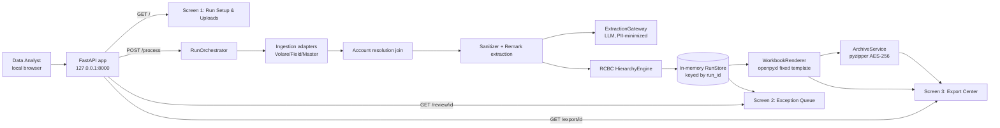
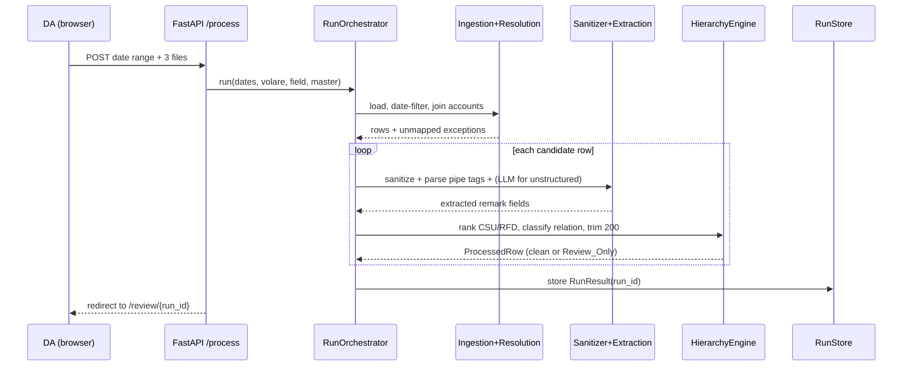

# Technical Design: RCBC Initial Demo (On-Demand Vertical Slice)

## Design status and scope

This design captures the approved execution directive for a de-scoped, on-demand
RCBC Auto Loan vertical slice of the broader
[mc03-bank-report-automation](../mc03-bank-report-automation/design.md) system. It targets a
**live demo on September 18, 2026** and defines the technical and test approach only; it does
not authorize deployment, bank delivery, or production external transmission.

The slice executes the Phase-1 pivot mandated by Requirement 17 of the parent spec: TFS live
Viber chat ingestion is formally deferred pending external commercial prerequisites, so the
demo is 100% RCBC Auto Loan sourced from **three manual spreadsheet uploads**. Compared to the
parent system this slice intentionally removes multi-tenant persistence, background scraping,
authentication, sessions, and reviewer attribution.

### Relationship to the parent spec

This is the demo-grade realization of the parent RCBC rules. It preserves the parent's safety
principles (evidence before transformation, deterministic authority over the LLM, safe
incompleteness routed to `Review_Only`, fixed-template rendering, secret-safe archives) while
trading durability and gating machinery for on-demand simplicity. The parent spec files remain
authoritative for full production behavior and are **not** modified by this spec.

### De-scoping decisions (demo target)

| Parent capability | Demo slice decision |
| --- | --- |
| Session auth, reviewer identity | Removed. Run attribution defaults internally to `"DA"`. |
| Background Volare scraping / headless bots | Removed. Manual `.xlsx` uploads are the sole source of truth. |
| Durable multi-run persistence and Generation_Lock | Replaced by lazy, in-memory, per-run processing keyed by `run_id`. |
| Public Viber webhook listener | Not mounted in the demo. |
| Multi-Campaign selection | Fixed to RCBC Auto Loan. |
| Offsite access | None. Binds to `http://127.0.0.1:8000` (local desktop). |

### v1 demo boundaries

Explicitly excluded: user login, sessions, reviewer attribution fields, background ingestion,
report scheduling, direct XLSX editing, user-uploaded templates, automatic bank delivery,
server-side formula evaluation, and archive modes other than AES-256.

## Research foundations

The execution directive and the parent spec are the authoritative behavioral sources. The
following library constraints inform the design and are paraphrased for licensing compliance.
Content was rephrased for compliance with licensing restrictions.

- [openpyxl formula docs](https://openpyxl.readthedocs.io/en/stable/simple_formulae.html): the
  library stores formula strings but does not compute them. The renderer therefore preserves
  formula expressions and relies on Excel to recalculate on open; no server-side calculation
  engine is required for completion.
- [pyzipper docs](https://pypi.org/project/pyzipper/): `AESZipFile` produces WinZip-compatible
  AES-256 encrypted archives. The archive service uses it exclusively for the demo.
- [FastAPI request files](https://fastapi.tiangolo.com/tutorial/request-files/): multipart
  `UploadFile` streams uploads to a spooled temp file, which suits large `.xlsx` inputs.

These support implementation constraints only; they do not approve production behavior.

## Overview

A Data Analyst (DA) opens the local portal, selects a report date range, and uploads three
spreadsheets (Volare DRR, Field Result, Master File). Triggering **Process & Filter Data**
runs a lazy pipeline that filters by the date window, resolves accounts by joining Field Result
to Master File, sanitizes and extracts remarks, applies the RCBC hierarchy engine, and
auto-approves clean records. The DA reviews only actionable exceptions, then generates two
XLSX workbooks and one encrypted ZIP for manual download.

A realistic run is ~40,800 clean auto-approved records plus a small exception set. The pipeline
streams rows through pandas inside adapters and writes workbook rows iteratively so the browser
never holds a run in memory.

### Technology boundaries

| Concern | Choice | Constraint |
| --- | --- | --- |
| Runtime | Python 3.12, managed by `uv` (`uv run ...`), pinned in `pyproject.toml` | Workspace rule. |
| Web | FastAPI ASGI app bound to `127.0.0.1:8000`, Jinja2 for the 3 Stitch screens | Local only, no auth. |
| Tabular processing | pandas (inside adapters only) | Parsing stays out of the rule layer. |
| Config | `RuntimeSettings` (pydantic-settings), `MC03_` prefix, `__` nested delimiter | Reject unknown settings. |
| Storage | Protected local root via `build_protected_storage_paths` / `prepare_protected_storage` | Reject UNC/network paths. |
| LLM | Provider-neutral `ExtractionGateway`, PII-minimized input | No identifiers to the model. |
| Rendering | openpyxl from the fixed RCBC template | Preserve formulas/formatting. |
| Archive | pyzipper AES-256 | Password never logged/displayed. |
| Tests | pytest + Hypothesis, `tmp_path` fixtures | Fakes for LLM/archive/filesystem. |

## Architecture

### Logical topology



All components run in a single local process on one protected storage volume. There is no public
surface and no network filesystem.

### Package layout (preserve src/mc03)

```
src/mc03/
  settings.py              # RuntimeSettings (MC03_ prefix, __ delimiter), demo bind config
  storage.py               # build_protected_storage_paths / prepare_protected_storage
  domain/                  # business concepts (no I/O)
    models.py              # ProcessedRow, RunResult, Exception types, enums
    sanitizer.py           # prohibited-marker stripping
    remarks.py             # pipe-tag fast parser + trimming
    hierarchy.py           # RCBC RFD/CSU/representative engine
  persistence/
    run_store.py           # in-memory, run_id-keyed RunResult store
  services/
    web.py                 # FastAPI app factory + 3 routes + templates
    orchestrator.py        # RunOrchestrator: wires the lazy pipeline
    ingestion.py           # Volare/Field/Master adapters (pandas)
    resolution.py          # Field <-> Master account join
    extraction_gateway.py  # provider-neutral LLM boundary
    rendering.py           # openpyxl WorkbookRenderer
    archive.py             # pyzipper AES-256 ArchiveService
tests/                     # pytest, tmp_path, Hypothesis, fakes
```

### On-demand processing lifecycle



## Components and Interfaces

| Component | Responsibility | Key output / safeguard |
| --- | --- | --- |
| `RuntimeSettings` | Typed startup config with `MC03_` prefix | Rejects unknown settings; validates storage root. |
| `RunOrchestrator` | Wire the lazy per-run pipeline | Produces one `RunResult` per `run_id`; no scheduler. |
| Ingestion adapters | Load the 3 uploads, date-filter, choose candidates | pandas confined to adapters; failures visible. |
| `AccountResolver` | Join Field Result to Master File on `CH code` | Unmapped accounts flagged, routed to review. |
| `RemarkSanitizer` | Strip prohibited bank markers | Idempotent; auditable transformation. |
| `RemarkExtractor` | Pipe-tag fast parse, then LLM fallback | LLM never sees identifiers. |
| `ExtractionGateway` | Provider-neutral LLM boundary | PII-minimized request; no business decisions. |
| `HierarchyEngine` | CSU/RFD ranking, relation classing, 200-char trim | Ambiguity/overflow -> `Review_Only`. |
| `RunStore` | In-memory `run_id` -> `RunResult` | Demo-scoped; no durable multi-run state. |
| `WorkbookRenderer` | openpyxl fixed-template injection | Only mapped regions written; formulas preserved. |
| `ArchiveService` | pyzipper AES-256 packaging | Password never projected to UI/logs/filenames. |

### HTTP interface (FastAPI)

| Route | Method | Purpose |
| --- | --- | --- |
| `/` | GET | Screen 1: date pickers + 3 file inputs + Process button. |
| `/process` | POST | Accept `report_date_from`, `report_date_to`, `volare_drr`, `field_result`, `master_file`; run pipeline; redirect to review. |
| `/review/{run_id}` | GET | Screen 2: actionable exceptions only (clean records auto-approved). |
| `/review/{run_id}/decision` | POST | Apply inline approve/exclude/edit (CSU/RFD) to one exception. |
| `/export/{run_id}` | GET | Screen 3: reconciliation summary + generate/download actions. |
| `/export/{run_id}/generate` | POST | Render workbooks + build encrypted ZIP. |
| `/download/{run_id}/{artifact}` | GET | Stream a completed artifact for manual download. |

## Data Models

### Field mapping across the three uploads

| Upload | Key columns | Demo handling |
| --- | --- | --- |
| `volare_drr` (.xlsx) | status, disposition, remarks, call date | Date-filter; cleaner exclusions; substitutions; purge patterns; numeric rank from REF sheet. |
| `field_result` (.xlsx) | `CH code` .. `OB`, bank, status, visit_date | Keep `bank == 'RCBC Auto Loan'`, `status != 'Cancelled'`, visit_date in window. |
| `master_file` (.xlsx) | `CH code`, `Account Number`, status | Merge on `CH code`; valid statuses `RETAIN`/`RESOLVED`/`PULLOUT`; missing -> unmapped. |

### Domain types

```python
from __future__ import annotations

from dataclasses import dataclass, field
from datetime import date, datetime
from enum import Enum


class Disposition(str, Enum):
    """Export disposition for a processed row."""

    CLEAN = "clean"          # auto-approved, compliant
    REVIEW_ONLY = "review"   # actionable exception, needs DA decision
    EXCLUDED = "excluded"    # dropped as noise or DA exclusion


class ExceptionKind(str, Enum):
    """Why a row needs DA review."""

    REMARK_TOO_LONG = "remark_too_long"
    UNMAPPED_ACCOUNT = "unmapped_account"
    AMBIGUOUS_INFORMANT = "ambiguous_informant"


class Relation(str, Enum):
    """Classification of the contacted person."""

    REPRESENTATIVE = "representative"  # blood relative / immediate family
    INFORMANT = "informant"            # neighbor, guard, barangay, colleague
    UNKNOWN = "unknown"


@dataclass(frozen=True)
class RemarkFields:
    """Structured remark parsed from pipe tags or LLM extraction."""

    type_of_rfd: str | None
    rfd: str | None
    detailed_rfd: str | None
    remarks: str | None
    contact_person: str | None
    statement: str | None
    source_timestamp: datetime | None


@dataclass(frozen=True)
class ProcessedRow:
    """One resolved, sanitized, ranked row ready for export or review."""

    ch_code: str
    account_number: str | None
    relation: Relation
    csu_rank: int
    selected_rfd: str | None
    sanitized_remark: str
    remark_length: int
    disposition: Disposition
    exception_kinds: tuple[ExceptionKind, ...] = ()
    source_row_ref: str = ""


@dataclass
class RunResult:
    """In-memory result of one on-demand run, keyed by run_id."""

    run_id: str
    attribution: str = "DA"
    date_from: date | None = None
    date_to: date | None = None
    clean_rows: list[ProcessedRow] = field(default_factory=list)
    review_rows: list[ProcessedRow] = field(default_factory=list)
    excluded_count: int = 0
    artifacts: dict[str, str] = field(default_factory=dict)  # name -> protected path
```

## Low-Level Design (algorithms, signatures, formal specs)

### Ingestion and account resolution

```python
def load_volare_drr(path: str, date_from: date, date_to: date) -> "pandas.DataFrame":
    """Load Volare DRR, keep rows in the date window, drop excluded statuses.

    Preconditions:
      - path points to a readable .xlsx under the protected storage root.
      - date_from <= date_to.
    Postconditions:
      - Returned frame excludes status in {BP, New, Reactive, Abort, Lock, Failed, Field}.
      - String substitutions and purge patterns applied to the remarks column.
      - A numeric rank column is populated from the DRR template REF lookup table.
      - No row outside [date_from, date_to] remains.
    """


def load_field_result(path: str, date_from: date, date_to: date) -> "pandas.DataFrame":
    """Load Field Visitation file filtered to RCBC Auto Loan within the window.

    Postconditions:
      - Only rows with bank == 'RCBC Auto Loan', status != 'Cancelled',
        and visit_date within [date_from, date_to] remain.
      - Columns 'CH code' through 'OB' are preserved.
    """


def resolve_accounts(
    field_df: "pandas.DataFrame", master_df: "pandas.DataFrame"
) -> tuple["pandas.DataFrame", list[str]]:
    """Left-merge field rows to master on 'CH code' -> 'Account Number'.

    Valid master statuses: RETAIN, RESOLVED, PULLOUT.
    Postconditions:
      - Each field row gains Account Number when a valid master match exists.
      - Returns (resolved_df, unmapped_ch_codes); unmapped rows are flagged
        UNMAPPED_ACCOUNT and routed to Review_Only (never silently dropped).
    """
```

### Prohibited-tag sanitization

```python
def sanitize_remark(text: str) -> str:
    """Strip internal bank markers from a remark, idempotently.

    Removes: BCAL-prefixed CH codes, L3 labels, INB/OBD call-direction markers,
    PH codes, '.com' web links, and SRC tags.

    Properties:
      - sanitize_remark(sanitize_remark(t)) == sanitize_remark(t)  (idempotent)
      - No prohibited marker pattern remains in the output.
    """
```

```pascal
ALGORITHM sanitize_remark(text)
BEGIN
  result <- text
  FOR each pattern IN [BCAL_CH, L3, INB, OBD, PH_CODE, DOTCOM_LINK, SRC] DO
    result <- REGEX_REMOVE(result, pattern)
  END FOR
  result <- COLLAPSE_WHITESPACE(result)
  RETURN result
END
```

### Remark extraction pipeline

```python
PIPE_PATTERN = (
    r"TYPE OF RFD\s*:\s*(?P<type>.*?)\|"
    r"\s*RFD\s*:\s*(?P<rfd>.*?)\|"
    r"\s*DETAILED RFD\s*:\s*(?P<detail>.*?)\|"
    r"\s*REMARKS\s*:\s*(?P<remarks>.*)"
)


def extract_remark(text: str, gateway: "ExtractionGateway") -> RemarkFields:
    """Fast-parse structured pipe tags; fall back to the LLM for free text.

    Preconditions:
      - text has already been sanitized.
    Postconditions:
      - If the pipe pattern matches, fields come directly from the regex groups
        (no LLM call).
      - Otherwise the gateway is invoked with PII-minimized input: account numbers,
        CH codes, and borrower names are never included in the request.
      - Malformed/low-confidence LLM output yields None fields (no invented values).
    """
```

### RCBC hierarchy engine

```python
REPRESENTATIVE_RELATIONS = frozenset(
    {"parent", "sibling", "spouse", "child", "aunt", "tita",
     "uncle", "tito", "nephew", "niece", "kapamilya"}
)
INFORMANT_RELATIONS = frozenset(
    {"neighbor", "security guard", "barangay official", "colleague"}
)

PRIMARY_RFD_ORDER = (
    "explicit", "borrower_refused", "representative_refused",
    "no_contact", "moved_out",
)
EXPLICIT_SECONDARY_ORDER = (
    "medical_expense", "diversion_of_funds", "delayed_salary",
    "delayed_collection", "business_slowdown", "third_party_user",
)


def classify_relation(contact_relation: str) -> Relation:
    """Map a contact relation to REPRESENTATIVE, INFORMANT, or UNKNOWN.

    Invariant: an INFORMANT relation is never eligible for
    'Representative Refused' classification.
    """


def csu_rank(client_sentiment: str, unit_sentiment: str) -> int:
    """Rank Collection Status Update: CP+UP > CP+UN > CN.

    Returns a total-order integer (higher = stronger positive).
    """


def select_rfd(candidates: list[RemarkFields]) -> str | None:
    """Select the winning RFD across candidates.

    Ordered decision:
      1. Primary hierarchy: Explicit > Borrower Refused > Representative Refused
         > No Client/Representative Reached > Moved Out.
      2. Among Explicit candidates, secondary tie-break:
         Medical > Diversion > Delayed Salary > Delayed Collection
         > Business Slowdown > Third-Party User.
      3. Remaining ties: latest source_timestamp.

    Property: the result is invariant under any permutation of `candidates`.
    """


def trim_to_200(contact_person: str, statement: str) -> tuple[str, bool]:
    """Trim a remark to <= 200 chars preserving contact person and statement.

    Returns (remark, fits). If both fields cannot fit within 200 chars,
    fits is False and the caller routes the row to Review_Only rather than
    silently dropping either field.
    """
```

```pascal
ALGORITHM select_rfd(candidates)
BEGIN
  FOR each tier IN PRIMARY_RFD_ORDER DO
    tier_set <- { c IN candidates : primary_class(c) = tier }
    IF tier_set is not empty THEN
      IF tier = "explicit" THEN
        FOR each sub IN EXPLICIT_SECONDARY_ORDER DO
          sub_set <- { c IN tier_set : secondary_class(c) = sub }
          IF sub_set not empty THEN
            RETURN latest_by_timestamp(sub_set).rfd
          END IF
        END FOR
      END IF
      RETURN latest_by_timestamp(tier_set).rfd
    END IF
  END FOR
  RETURN NULL
END
```

### Orchestration

```python
def process_run(
    date_from: date,
    date_to: date,
    volare_path: str,
    field_path: str,
    master_path: str,
    gateway: "ExtractionGateway",
) -> RunResult:
    """Execute the full lazy pipeline and return an in-memory RunResult.

    Postconditions:
      - Every candidate row lands in exactly one of clean_rows, review_rows,
        or the excluded count.
      - Unmapped accounts, remark overflow, and ambiguous informants are
        review_rows, never silent omissions.
      - attribution defaults to 'DA'; no reviewer identity is required.
    """
```

### Rendering and archive

```python
TEMPLATE_NAME = "RCBC AL_NEW-CSR_TEMPLATE JUNE 2026 (V1).xlsx"


def render_workbooks(result: RunResult, template_path: str, out_dir: str) -> dict[str, str]:
    """Inject rows into the fixed template's mapped regions with openpyxl.

    Postconditions:
      - Only Output_Mapping_Regions in the FIELD RSULT and DRR sheets are written.
      - Formulas, header formatting, and REF/REFERENCE/MASTERLIST sheets are
        preserved; formulas are not evaluated server-side.
      - Returns {'bank_csr': path, 'internal_csr': path} under out_dir.
    """


def build_encrypted_archive(paths: list[str], out_zip: str, run_month: date) -> str:
    """Package workbooks with pyzipper AES-256.

    Password format: 3-letter uppercase month + 4-digit year (e.g. 'SEP2026').
    Postconditions:
      - The archive is AES-256 encrypted.
      - The password never appears in logs, UI, or the archive/file name.
    """
```

## Example Usage

```python
from mc03.services.orchestrator import process_run
from mc03.services.extraction_gateway import ExtractionGateway

result = process_run(
    date_from=date(2026, 9, 2),
    date_to=date(2026, 9, 3),
    volare_path="/protected/uploads/volare.xlsx",
    field_path="/protected/uploads/field.xlsx",
    master_path="/protected/uploads/master.xlsx",
    gateway=ExtractionGateway.from_settings(settings),
)
assert all(r.remark_length <= 200 for r in result.clean_rows)
assert all(r.disposition is Disposition.REVIEW_ONLY for r in result.review_rows)
```

## Correctness Properties

Implemented with Hypothesis (`@settings(max_examples=100)`), one test per property, using fakes
for the LLM, archive, and filesystem.

### Property 1: Sanitizer idempotence and completeness
For all remark strings, `sanitize_remark` is idempotent and leaves no prohibited marker pattern
(BCAL, L3, INB, OBD, PH code, `.com` link, SRC) in the output.

**Validates: Requirements 6.1, 6.2, 6.3**

### Property 2: Account resolution never drops rows
For all field/master frames, every field row is either resolved to a valid Account Number or
flagged `UNMAPPED_ACCOUNT` and routed to review; the union of resolved and unmapped equals the
input row set.

**Validates: Requirements 5.3, 5.4**

### Property 3: RFD selection permutation invariance
For all permutations of a candidate set, `select_rfd` returns the same RFD via the primary
hierarchy, the explicit secondary tie-break, then latest timestamp.

**Validates: Requirements 10.1, 10.2, 10.3, 10.4**

### Property 4: Representative exclusivity
For all contact relations, an informant relation (neighbor, guard, barangay official, colleague)
is never classified as Representative Refused.

**Validates: Requirements 8.2, 8.3**

### Property 5: 200-char trim preserves required fields or defers
For all contact-person/statement pairs, `trim_to_200` either returns a `<= 200` char remark
containing both fields or reports it does not fit, in which case the row is `Review_Only`.

**Validates: Requirements 11.1, 11.2**

### Property 6: Disposition conservation
For all runs, every candidate row is in exactly one of clean, review, or excluded; counts
reconcile to the candidate set with no hidden omissions.

**Validates: Requirements 12.1, 12.2, 12.3**

### Property 7: LLM input minimization
For all rows routed to the gateway, the outgoing request contains no account number, CH code, or
borrower name.

**Validates: Requirements 7.3**

### Property 8: Archive secrecy
For all runs, the derived archive password never appears in logs, UI responses, or artifact file
names.

**Validates: Requirements 16.2, 16.3**

## Error Handling

| Stage | Example condition | DA-visible outcome |
| --- | --- | --- |
| Upload | Missing file, unreadable/non-`.xlsx` | Field-specific error on Screen 1; no run created. |
| Date window | `date_from > date_to` | Validation error on Screen 1. |
| Resolution | Unmapped account | Row appears in review queue with unmapped flag. |
| Extraction | Malformed/low-confidence LLM output | Affected fields null; row to `Review_Only`. |
| Rules | Both contact + statement exceed 200 chars | Row to `Review_Only` (no silent field loss). |
| Rendering | Template missing / mapping mismatch | Visible render failure; no unrecorded substitute. |
| Archive | pyzipper failure | Completed workbooks preserved; visible archive failure. |

Portal responses and logs never expose the archive password or PII passed to/from the LLM.

## Testing Strategy

| Layer | Scope |
| --- | --- |
| Unit | Sanitizer, pipe parser, `csu_rank`, `select_rfd`, `classify_relation`, `trim_to_200`, `RuntimeSettings` validation, storage-path guards. |
| Property | The 8 properties above with Hypothesis and fakes. |
| Integration | FastAPI routes with `tmp_path` fixtures: `/process` with sanitized sample `.xlsx`, review decisions, `/export` generation, download streaming. |
| Rendering/archive | openpyxl template preservation (formulas/hidden sheets) and pyzipper AES-256 round trip with a fake password. |
| Dry run | End-to-end with historical data (`Copy_of_DRR_TEMPLATE_UPDATED_FINAL_DRR_September_02-03_.xlsx`) and deliverable verification. |

Commands (per workspace rules): `uv run pytest`, `uv run ruff check .`, `uv run mypy src`.

## Dependencies

Pinned exactly in `pyproject.toml` and managed via `uv add --exact`:

- `fastapi`, `uvicorn`, `python-multipart`, `jinja2` — local web app and uploads.
- `pandas`, `openpyxl` — spreadsheet ingestion and template rendering.
- `pydantic`, `pydantic-settings` — typed `RuntimeSettings`.
- `pyzipper` — AES-256 archive.
- Dev extra: `pytest`, `hypothesis`, `ruff`, `mypy`.

## Execution plan (Sept 15–18, 2026)

| Date | Deliverable |
| --- | --- |
| Sept 15 | FastAPI upload routes, date-window filtering, Master File account-resolution join. |
| Sept 16 | Noise exclusion, marker sanitizer, pipe extraction, RCBC ranking, 200-char trimmer. |
| Sept 17 | Exception-queue state handling, openpyxl template injection, pyzipper AES-256 packaging. |
| Sept 18 | End-to-end dry run with historical data and deliverable verification. |

## Review boundaries and next-phase handoff

This design is a demo-scoped vertical slice. It deliberately preserves the parent spec's
unresolved production gates (Volare authorization, Master_File ownership, exact RCBC cap and
password format, archive recipient compatibility, LLM compliance) as out-of-scope for the demo;
enabling any of them in production requires returning to the parent spec's requirements and
gates. The next Design-First phase derives requirements from this design, then creates tasks.
No application implementation is authorized by this document.
